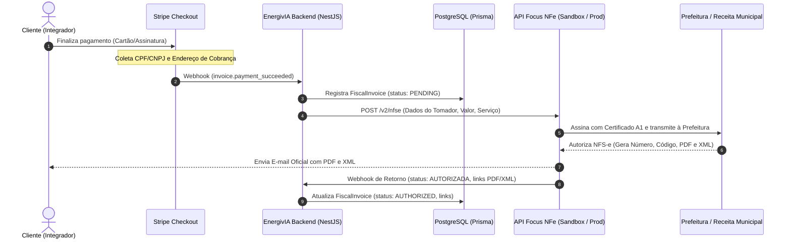

# Documento de Definição e Design: Emissão Automática de Nota Fiscal (NFS-e)

> **Data:** 06/10/2026  
> **Status:** Aprovado / Pronto para Execução  
> **Módulo:** Faturamento & Fiscal / Assinaturas SaaS EnergivIA

---

## 1. Contexto e Objetivo

O EnergivIA comercializa assinaturas de planos de software (SaaS) para integradores solares via **Stripe**.
Toda vez que um cliente finalizar o pagamento de um plano no Stripe, o sistema deve disparar automaticamente a emissão de uma **Nota Fiscal de Serviços Eletrônica (NFS-e)** e enviar o **PDF e o XML** para o e-mail do tomador (cliente).

---

## 2. Decisões de Negócio & Escopo Alinhado

1. **Tipo de Pagamento:**
   - Apenas pagamentos de **assinaturas dos planos do EnergivIA** (SaaS via Stripe).
   - Não se aplica a vendas de usinas solares de clientes finais dos integradores.

2. **Tipo de Documento Fiscal:**
   - **NFS-e (Nota Fiscal de Serviços Eletrônica)** municipal ou Padrão Nacional.
   - Justificativa: Software como Serviço (SaaS) não é mercadoria física (não é NF-e/NFC-e), é prestação de serviço regida por imposto municipal (ISS).

3. **Provedor Fiscal Selecionado:**
   - **Focus NFe** (com arquitetura desacoplada / Adapter Pattern).
   - Plano selecionado para produção: **Solo (R$ 94,90/mês)**:
     - 1 CNPJ da empresa EnergivIA.
     - Até 100 notas/mês inclusas (R$ 0,11 por nota excedente).
     - Emissão de NFS-e inclusa.
   - **Ambiente de Desenvolvimento:** Uso do **Ambiente de Homologação (Sandbox gratuito)** da Focus NFe, permitindo implementar e testar todo o código com custo zero.

4. **Entrega da Nota Fiscal ao Cliente:**
   - **Envio automático por e-mail** disparado diretamente pela API da Focus NFe com o PDF e o XML anexados.
   - O painel web do EnergivIA permanece limpo (sem botões complexos de download inicialmente).

---

## 3. Arquitetura Técnica



---

## 4. Componentes a Serem Desenvolvidos

### 4.1. Coleta Fiscal no Stripe Checkout

No backend (`apps/api/src/modules/stripe/stripe.service.ts`):

- No método `createCheckoutSession`, habilitar:
  ```typescript
  tax_id_collection: { enabled: true },
  billing_address_collection: 'required',
  ```
  Isso garante que o Stripe exija e valide o CPF ou CNPJ do cliente brasileiro e o CEP/endereço antes de concluir o pagamento.

### 4.2. Modelo de Dados Prisma (`FiscalInvoice`)

Criar uma entidade no Prisma para auditoria, histórico e reprocessamento:

- `id`: CUID
- `tenantId`: Identificador do tenant
- `stripePaymentIntentId` / `stripeInvoiceId`: Vínculo com a transação
- `focusNfeReference`: ID de referência interna enviado à Focus NFe
- `status`: `PENDING` | `AUTHORIZED` | `ERROR` | `CANCELLED`
- `pdfUrl`: Link da nota autorizada
- `xmlUrl`: Link do XML oficial
- `errorMessage`: Registro de eventuais rejeições de prefeitura
- `amount`: Valor da transação em Reais
- `createdAt` / `updatedAt`

### 4.3. Módulo Fiscal (`FiscalModule`)

- `FiscalProvider` (Interface com `emitNfse`, `consultNfse`).
- `FocusNfeProvider` (Implementação com chamadas HTTP para o endpoint da Focus NFe).
- `FiscalService` (Orquestrador com retentativas e tratamento defensivo).
- Variáveis de ambiente:
  - `FOCUS_NFE_ENVIRONMENT`: `homologacao` ou `producao`
  - `FOCUS_NFE_TOKEN`: Token gerado no painel da Focus NFe
  - `COMPANY_MUNICIPAL_TAX_CODE`: Código do serviço municipal (ex: 1.07 - Licenciamento de software)
  - `COMPANY_ISS_RATE`: Alíquota de ISS do município da EnergivIA (ex: 2.0% a 5.0%)

### 4.4. Integração no Webhook do Stripe

- Escutar os eventos `invoice.payment_succeeded` e `checkout.session.completed`.
- Extrair o tomador (`customer_details.tax_ids`, endereço, email, nome).
- Chamar `fiscalService.createInvoiceFromStripePayment(...)`.

---

## 5. Como Retomar Este Projeto na Próxima Sessão

Ao iniciar uma nova conversa, basta dizer:

> _"Quero iniciar a implementação da emissão de notas fiscais com a Focus NFe conforme o documento em `docs/plans/2026-10-06-emissao-nota-fiscal-focus-nfe-design.md`"_

O assistente lerá este arquivo e já executará o plano de tarefas correspondente no modo **Sandbox (Homologação Gratuita)**.
